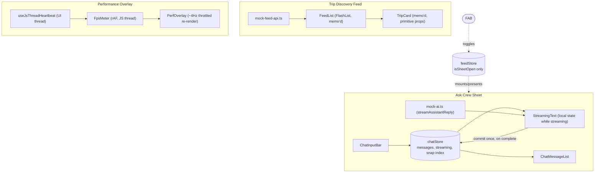

# Crew — Trip Discovery Feed + Ask Crew AI

A React Native (Expo Router) take-home: a high-performance Trip Discovery
Feed, an "Ask Crew" AI bottom sheet, and a custom Performance Overlay.
Graded primarily on FPS/perf engineering, not feature count.

## Contents

- [Demo](#demo)
- [Documentation](#documentation)
- [Architecture](#architecture)
- [Setup](#setup)
- [State management rationale](#state-management-rationale)
- [Known limitations](#known-limitations)
- [Project structure](#project-structure)

## Demo

**Android (physical device)**

https://github.com/user-attachments/assets/b71d43f1-b53f-4079-9a6e-60cbf0089c73

**iOS (simulator)**

The iOS simulator recording is over 50MB (too large to upload here) — scan the QR code to download it.


## Documentation

| Doc | What's in it |
|---|---|
| [`CLAUDE.md`](./CLAUDE.md) | Source of truth for in-repo decisions — tech stack (with the *why*, including dead ends like the `@gorhom/bottom-sheet` → `@expo/ui` swap), non-negotiable performance rules, data model, design tokens |
| [`PERFORMANCE.md`](./PERFORMANCE.md) | Methodology, real measured p50/p95/worst-frame numbers, the deliberately-reproduced-and-fixed bottleneck with before/after evidence, one honest trade-off |
| [`perf-runs/`](./perf-runs) | Raw `PerfRun` JSON artifacts backing the numbers in `PERFORMANCE.md` |
| [Architecture & Implementation Plan](https://app.notion.com/p/39b2d843b19f81929b15c5bac93c6aab) (Notion) | Original planning doc — tech stack decisions, phase breakdown, testing plan. Updated post-implementation as decisions changed. |
| [Engineering Plan & ERD](https://app.notion.com/p/39b2d843b19f812a814feb2275a54163) (Notion) | Data model, entity relationships, TypeScript contracts |
| [Design Docs — Exact Spec](https://app.notion.com/p/39b2d843b19f812bbc64e20c74d23b28) (Notion) | Pixel-level design tokens and per-screen spec |
| [Claude Code — Build Plan & Phase Prompts](https://app.notion.com/p/39c2d843b19f813ba707c44473586945) (Notion) | The `CLAUDE.md` source and copy-paste phase prompts this repo was built from |

## Architecture

Bare-minimum shape — three independent surfaces sharing a screen, not a query.
There is no foreign key anywhere linking a chat message to a trip bundle, which
is what makes "chat updates never re-render the feed" a property of the
architecture rather than something to remember to protect.



The two dotted lines are the *only* connective tissue between the feed and
chat domains — a boolean flag, not shared data. `feedStore` never holds trip
or chat data; `chatStore` never holds trip data. See `CLAUDE.md`'s
non-negotiable rules for how this is enforced.

## Setup

This app uses `@expo/ui`'s native bottom sheet, which is **not supported in
Expo Go** — you need a custom dev client.

```bash
pnpm install
pnpm generate:mock-data   # regenerates src/data/mock-bundles.json if needed
pnpm android               # or: pnpm ios
```

`pnpm start` alone just boots Metro — you still need a dev client build
(`pnpm android`/`pnpm ios`) installed on the device/emulator/simulator at
least once; after that, `pnpm start` + reopening the installed app is enough
for iteration.

Requires a physical device or emulator/simulator — some of what's being
graded (real frame timing, native bottom sheet behavior) isn't meaningful on
a headless environment.

## State management rationale

Two narrow Zustand stores, not one global store, not Context:

- **`feedStore`** (`src/store/feed-store.ts`) — just `isSheetOpen: boolean`.
  Trip bundle data itself is never in a store — it's a static, one-time-loaded
  array handed directly to `FlashList`'s `data` prop, since there's no
  mutation and no benefit to indirection.
- **`chatStore`** (`src/store/chat-store.ts`) — chat messages, streaming
  state, sheet snap index. Only components inside the Ask Crew sheet
  subscribe to it.

The reasoning: the biggest silent killer in "feed + sheet" apps is a shared
store/context where a chat token update triggers a re-render of the feed
tree. Two stores with narrow selectors means a streamed token can never
schedule a re-render of `FeedList` (which is also `React.memo`'d with
primitive-only props) — this is enforced as a non-negotiable rule, not just
a preference, see `CLAUDE.md` rule #4. While a message streams, the growing
text lives in local component state inside the message bubble
(`StreamingText`), committed to `chatStore` exactly once, on completion —
rule #3.

## Known limitations

- **Android: chat input invisible at the sheet's partial (50%) height.**
  `ChatInputBar` only renders once the sheet is fully expanded (92%) on
  Android — a known, deferred issue with `@expo/ui`'s native sheet. A
  from-scratch custom sheet replacement got further (fixed presenting, fixed
  a separate Reanimated/secondary-Fabric-surface crash) but hit an
  unrelated FlatList/ScrollView-sibling rendering bug and broke iOS in the
  process — reverted back to `@expo/ui` rather than ship something broken on
  both platforms. Full history in `CLAUDE.md`.
- **The Ask Crew sheet can only be presented/dismissed, not snapped to a
  specific point, imperatively.** `@expo/ui`'s `BottomSheetModal` exposes
  `present()`/`dismiss()` only — no `snapToIndex`-equivalent. This means the
  scripted perf-test harness (`src/utils/perf-test-harness.ts`) can only
  drive the sheet to its initial ("half") snap point, not programmatically
  drag it to full height — see `PERFORMANCE.md`.
- **Custom `handleComponent`/`backgroundStyle` sheet styling mostly has no
  effect.** It's a real native sheet (Material3 `ModalBottomSheet` on
  Android, SwiftUI sheet on iOS), not a custom-drawn one, so it renders its
  own chrome — the Design Docs' exact drag-handle/corner-radius spec is
  approximate, not pixel-exact, for this component.
- **Day-highlight icons and the FAB sparkle icon use raw `react-native-svg`**
  instead of `@expo/vector-icons`, a pre-existing deviation from Phase 0/1
  that predates the Phase 2 convention (chat icons use `@expo/vector-icons`
  correctly). Not fixed as a drive-by — flagged here per `CLAUDE.md`.
- **Performance numbers in `PERFORMANCE.md` come from a dev-client build on
  a flagship (Pixel 9 Pro Fold, 120Hz) device**, not a release build or
  genuinely mid-range hardware — read as this device's ceiling under
  unoptimized JS, not as a release-build or low-end-device number. See
  `PERFORMANCE.md`'s "Honest trade-off" section for why.
- **The scripted perf-test harness reports aggregate stats per run, not
  per-step.** It can't currently attribute a given dropped frame to a
  specific script step (e.g. sheet open/close vs. expand/collapse) — see
  `PERFORMANCE.md`'s methodology section.

## Project structure

See `CLAUDE.md` for the full annotated tree, non-negotiable performance
rules, and the complete Phase 1–4 build history (including dead ends that
were tried and reverted, and why).
